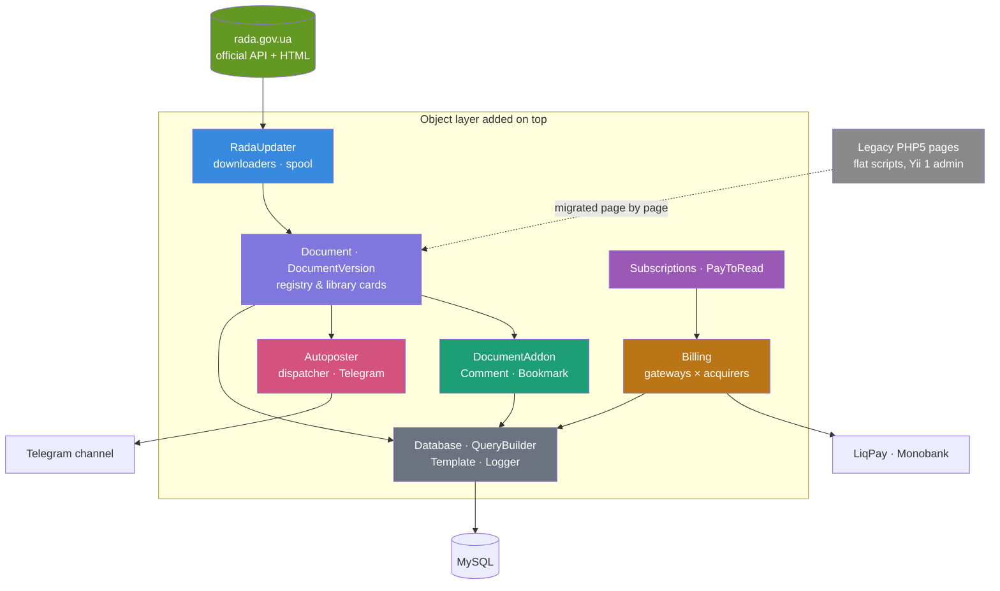

# ⚖️ zakon.help — Ukrainian Legislation, Kept Current

> Live: **[zakon.help](https://zakon.help/)**
>
> A working reference for people who read Ukrainian law for a living: every act kept in
> its current wording automatically, every past edition one click away, and professional
> commentary anchored to the exact paragraph it explains.

> ℹ️ **Portfolio showcase.** This repository describes the architecture and selected
> engineering of a private commercial project. The source code belongs to the client and is
> **not published here** — the snippets below are rewritten and trimmed for illustration.

---

## What is this?

I did not start this project. I inherited it: a PHP 5-era codebase with logic in flat
scripts at the web root, a bundled copy of Yii 1 in the admin area, and a folder honestly
named `___OBSOLETE`. The brief was the usual one — *"nothing works, please fix it"* — for a
site that was already live and could not be taken down.

So the work was not a rewrite. It was growing a proper object layer **inside** a running
legacy application: **~21,500 lines across 105 classes** organised into some twenty domain
areas — documents and versions, comments, bookmarks, billing, subscriptions, access,
parsing, autoposting — living alongside a codebase of roughly 79,000 lines that still had
to keep serving traffic while it was replaced piece by piece.

The features below are the ones worth describing. All of them were built in that layer.

---

## Architecture



---

## Tech Stack


---

## Engineering highlights

### 📡 Keeping thousands of laws current, automatically

Ukrainian legislation changes constantly, and a legal reference that is a week stale is
worse than useless — it is misleading. Documents are pulled from the parliament's own
sources: a document *card* (metadata and the list of editions) fetched by registration
number, then the full text, then parsed into individual elements so that paragraphs can be
addressed independently.

Each document lives in three tables — a registry card, a library entry per edition, and its
elements — so a new edition is a new row rather than an overwrite, and nothing that
referenced the old wording breaks.

Updating runs in two independent cron stages, which matters because the two halves fail
differently. First the official change list is refreshed — but only if it is actually stale,
so a misfiring cron cannot hammer a government API:

```php
private function updateRadaList(): void
{
    $status    = RadaUpdater::getStatus();
    $threshold = (new DateTime())->modify('-23 hours');

    if ($status['updated'] > $threshold) {
        die($this->say('Last time updated too early: ' . $status['updated']->format('d.m.y H:i')));
    }

    $result = RadaUpdater::updatesListLoad();      // fills the spool with what changed
    if (!$result['success']) {
        error_log($result['message']);
        die($this->say('Error while updating list.'));
    }
    $this->say('List updated. Potentially outdated: ' . $result['documents']);
}
```

The second stage drains that spool in batches, so a run that dies halfway leaves the queue
intact and the next run picks up where it stopped:

```php
private function updateBasicLaws(): void
{
    $queue = RadaUpdateManager::getNextNreg(0);
    if (empty($queue)) {
        return $this->say('Nothing to update');
    }
    $this->say('Spool: ' . count($queue) . ' docs');
    RadaUpdateManager::batchUpdate(0, FALSE, TRUE, TRUE, $queue);
}
```

### 🚩 Not trusting the source

The interesting part is what happens when the official source is itself provisional. The
parliament's site publishes documents whose amendments have not finished being incorporated,
marked with a notice in the body of the text. A downloader that trusted edition dates would
cache that provisional wording as final and never revisit it.

So the text is checked for that marker, and a document carrying it is flagged — logged and
kept eligible for re-fetching regardless of what its edition date claims:

```php
/**
 * Does the body carry the source's own "amendments still being processed" notice?
 * If so the published text is provisional, whatever its edition date says.
 */
protected function isSuspicious(string $html): bool
{
    return (bool) preg_match('/міни опрацьовуються/', $html);
}
```

A small regular expression, but it encodes something you only learn by watching the source
closely: the date it gives you is not a promise.

### 💬 Comments that outlive the law they were written on

The feature lawyers actually stayed for. A commentary written against the 2019 wording of an
article should still be visible when reading the 2024 wording — it is often *more* valuable
then, because it explains what changed. But it must not leak backwards into an older edition
someone is reading for historical reasons.

Comments attach to a specific edition. Reading any edition returns the comments of every
earlier edition of the same act, and none of the later ones — expressed as a single
subquery, with no duplication and no migration when a new edition arrives:

```sql
-- Comments visible on this edition: everything left on this act up to and including it.
doc_id IN (
    SELECT id FROM laws_library
     WHERE nreg = (SELECT nreg FROM laws_library WHERE id = :edition_id)
       AND id  <= :edition_id
)
```

Because library ids grow with each new edition of the same registration number, "earlier
edition" is just "smaller id". The accumulation is a property of the query, not a nightly job.

And a comment is not attached to the act as a whole — it hangs on the individual **paragraph**
it explains, so commentary appears inline beside the exact clause rather than in a pile at the
bottom of a long statute.

### 📌 Anchored to paragraphs, never to offsets

That anchoring is the quiet decision the whole annotation system rests on. Character offsets
are the obvious way to mark a place in a text and the wrong one: they break the moment the
wording shifts or the markup is re-rendered.

Instead the parser gives every element of a document a stable name taken from the source
document's own structure, and renders each one carrying it:

```php
// Every parsed element keeps the identifier the source itself gave it.
return sprintf('<%1$s name="%2$s" %4$s>%3$s</%1$s>', $tag, $element['id'], $text, $class);
```

A comment then belongs to one named element. A bookmark spans a *range* of them: the user
selects across the page, and what is stored is the name of the first element and the name of
the last — never a pixel, never a character count.

```js
// Selection captured as element names…
coords.block_start = startElement.getAttribute('name')
coords.block_end   = endElement.getAttribute('name')

// …and restored later by the same names, whatever the page looks like now.
const from = document.querySelector(`[name="${bookmark.block_start}"]`)
const to   = document.querySelector(`[name="${bookmark.block_end}"]`)
```

Bookmarks carry more besides the range: a flag for "the whole document" rather than a span, a
colour, the user's own note, and folders to organise them. They can also be anchored to a
*comment* instead of the legislative text — you can bookmark another lawyer's analysis exactly
as you bookmark the article it discusses.

### 🧩 One abstraction for everything attached to a document

Comments were not the only thing that needed anchoring to a paragraph — bookmarks, editorial
notes and inserted paragraphs all share the same shape: a piece of content bound to a
document, an edition, and a named element inside it. That shape became a single abstract
base:

```php
abstract class DocumentAddon
{
    const F_DOCUMENT_ID         = 'document_id';
    const F_DOCUMENT_VERSION_ID = 'document_version_id';
    const F_ELEMENT_NAME        = 'element_name';   // the paragraph it hangs on

    public static function loadById($id): static|false { /* … */ }
    public function save(): bool { /* insert or update, depending on identity */ }
    public function delete(bool $simulate = false): void { /* … */ }

    /** Each subclass declares how its own fields are laid out for storage. */
    abstract protected function prepareFields();
}
```

`Comment` and `Bookmark` extend it and add only what is genuinely theirs. Adding another kind
of annotation means implementing one method.

### 💳 Payment method and acquirer, abstracted separately

Two things vary independently here, and conflating them is the usual mistake. *How* a user
pays — instantly by card, or by generating an invoice to settle later — is one axis. *Who
processes the card* is another. So there are two contracts rather than one.

The payment method is chosen from the transaction:

```php
class GateWayFactory
{
    public static function createGateway(Transaction $transaction): GateWay
    {
        return match ($transaction->getType()) {
            Transaction::TYPE_ONLINE  => new GateWay__online($transaction),
            Transaction::TYPE_INVOICE => new GateWay__invoice($transaction),
            default => throw new \ErrorException("Unsupported gateway type: {$transaction->getType()}"),
        };
    }
}
```

…while the acquirer sits behind its own interface, so LiqPay and Monobank are interchangeable
underneath either method:

```php
interface AcquiringClient
{
    public function prepare();                      // build the provider-specific payload
    public function send();                         // create the invoice / payment session
    public function setSum($sum);                   // in minor units
    public function setResultUrl($url);
    public function setSuccessUrl($url);
    public function setErrorUrl($url);
    public function getInvoiceStatus($invoiceId);   // poll, rather than trust the callback alone
}
```

`getInvoiceStatus` is deliberate: the state of a payment can always be re-established by
asking the provider, instead of depending on a callback having arrived.

### 📚 Paid access, and letting other people sell

Beyond subscriptions the site hosts material written by third parties — practising lawyers
publishing their own books and articles, free or paid. Anything sellable implements a common
`SiteMaterial` contract, and access is resolved in one place rather than sprinkled through
the pages:

- `Subscriptions` — recurring access to the reference itself
- `PayToRead` — per-item purchase of an author's material
- `Billing\UserDeposit` and `TransactionManager` — balance and transaction records
- `Access\UserAccess` — the single answer to "may this user read this?"

### 📢 Announcing new material to Telegram

New articles are published to a Telegram channel automatically. The dispatcher is kept
separate from the poster — it decides *what* should go out and records what already has,
while the poster only knows *how* to talk to one channel:

```php
public function check(): bool
{
    $next = $this->getNextArticle();          // oldest article not yet posted
    if (!$next) {
        return FALSE;
    }
    $ok = (new TGPoster())->post($this->buildMessage($next));
    $this->saveSentRecord($next->getId(), $ok);   // success or failure, both recorded
    return $ok;
}
```

Every attempt is written down with its outcome, so a failed post is visible rather than
silently lost, and an article can never be announced twice.

---

## Other things worth a mention

- **A document model instead of queries.** `Document`, `DocumentVersion`, registry and library
  cards replaced ad-hoc SQL scattered through page scripts. Loading an act by registration
  number and edition date, listing its editions, or asking whether it is obsolete became
  method calls.
- **A small persistence layer.** A PDO wrapper and a query builder gave the new classes a
  consistent way to read and write, so migrated code stopped concatenating SQL by hand.
- **Migration without a big bang.** Legacy pages were moved onto the new classes one at a
  time, which is why old and new coexisted throughout — the site never went dark for a
  rewrite.

---

## Status

The object layer described here was built inside a live legacy application over several
years and covers documents, annotations, billing, subscriptions and publishing. The legacy
scripts it was designed to replace still exist beneath it: on a system that has to stay up,
replacement is a direction of travel rather than an event.
